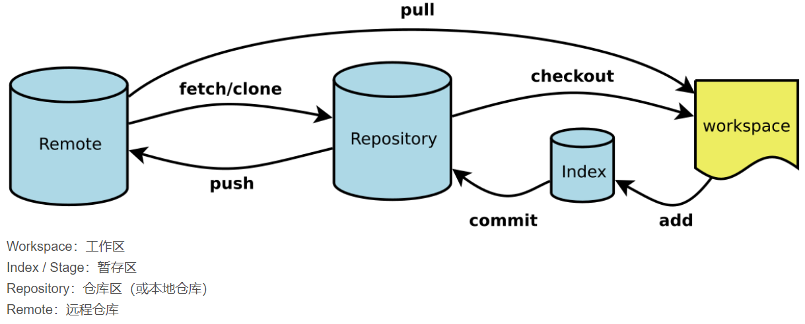

**git工作流程**





**git配置**
> \$ git config --global user.name "Your Name"
> \$ git config --global user.email "email@example.com"


**常用命令行**
1. <kbd>git init</kbd>，把当前目录变成Git可以管理的仓库
1. <kbd>git add</kbd>，把文件添加到暂存区
2. <kbd>git commit</kbd>，把文件提交到仓库
   ```git
   git commit -m "add a new file"
   ```
3. 